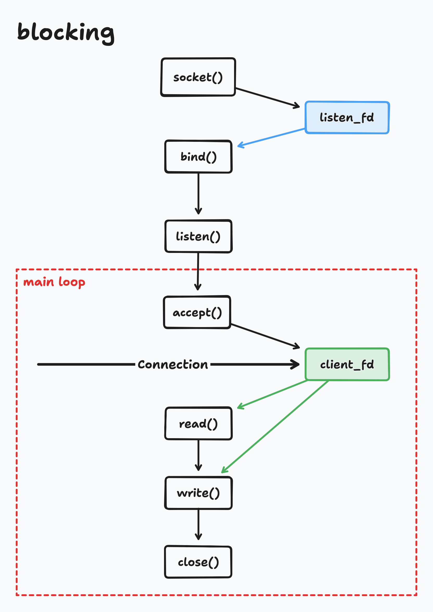
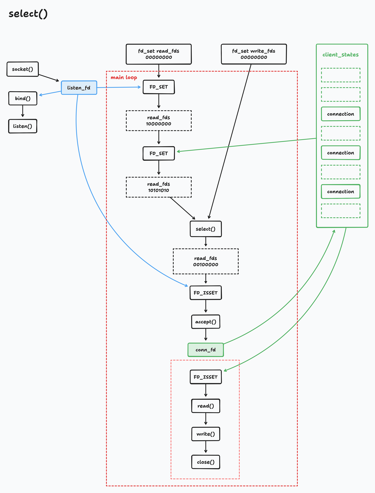
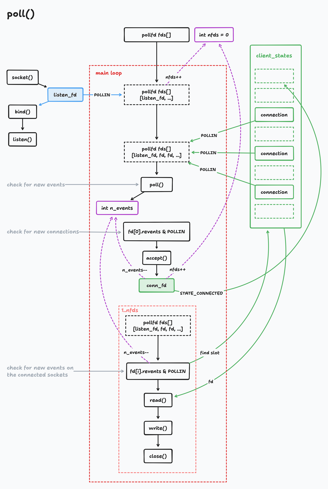

# Low-Level Academy: [Netcode That Doesn't Suck](https://lowlevel.academy/player/2)

Implementing simple networked DB using multiplexing.

[Tldraw project](https://www.tldraw.com/r/51CAWWFyOWjvMcgC_AUAl?d=v2048.-400.3907.2470.page)

## Blocking Requests

## `select()`

## `poll()`

